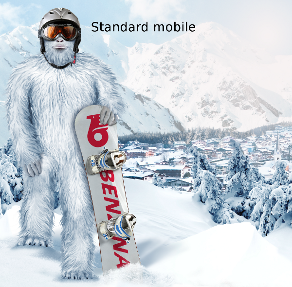

/css/less/bootstrap-less-src - zdrojové soubory které byly použity pro vygenerování Bootstrapu
/css/less/style.less - LESS soubor, který byl použitý k vygenerování hlavního CSS style.min.css
/blog.php a /blog.2.php - různé umístění sekce Explore more work

================================================
Vložení responzivního retina obrázku
------------------------------------------------

1. způsob
~~~~~~~~~~

~~~~~~~~~~

pro standardní rozlišení se využívají tyto atributy:
* data-mobile-src
* data-tablet-src
* data-desktop-src

* pro Retina rozlišení jejich 2x varianty

2. způsob
---------

V případě, že je pro každé rozlišení stejný obrázek, pak lze obrázek vložit takto:
~~~~~~~~~~

~~~~~~~~~~

logika atributů data-src a data-src2x je shodná jako v předchozím případě.

každý responzivní Retina  tag také musí mít class="hires" a nadefinovanou šířku a výšku.

